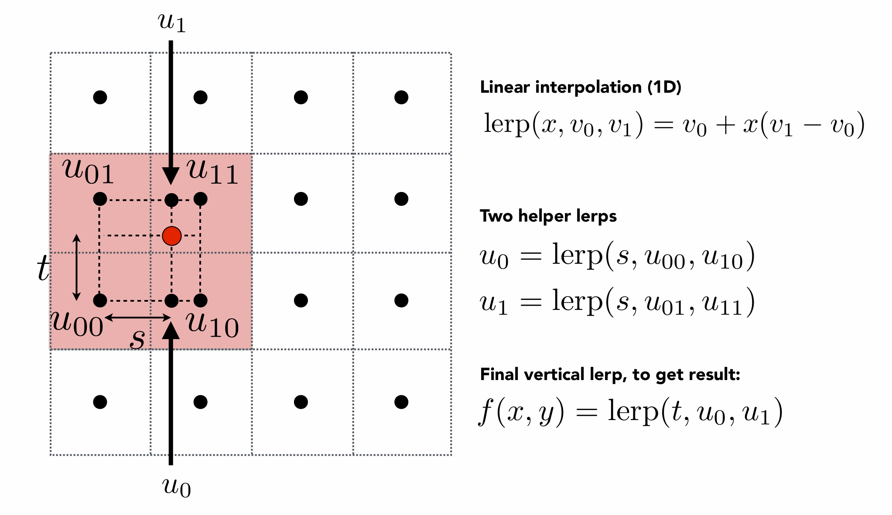

# GAMES101
# Lecture Notes
- Rodrigues' Rotation Formula : $$Rotation\ by\ angle\ \alpha\ around\ axis\ \mathbf{n}$$

$$\mathbf{R}(\mathbf{n}, \alpha) = \cos(\alpha) \mathbf{I} + (1 - \cos(\alpha)) \mathbf{n} \mathbf{n}^T + \sin(\alpha) \underbrace{\left( \begin{array}{ccc}0 & -n\_z & n\_y \\\\n\_z & 0 & -n\_x \\\\-n\_y & n\_x & 0\end{array}\right)}_{\mathbf{N}}$$
- The rotation matrix is orthogonal
## MVP: 
- Model Transform
- View Transform
- Projection Transform:
    - Orthographic Projection
        - cuboid to "canonical" cube [-1, 1]3
    - Pespective Projection : Human eye, most common, Furthur objects are smaller
        - frustum to "canonical" cube
## Rasterization
- Anti-Alias : Blurring(Pre-Filtering) Before Sampling
- High-Pass Filter : Remain Edges(Edges are high frequency since they change rapidly)
- Low-Pass Filter : Blur
- MSAA : Assignment 2
## Visiblity / Occlusion 
- Painter's Algorithm
    - Z-Buffering
## Shading
- Lambertian (Diffuse) Shading
- Blinn-Phong Reflection Model
    $$ L = L_a + L_d + L_s \\= k_a I_a + k_d \left( \frac{I}{r^2} \right) \max(0, \mathbf{n} \cdot \mathbf{l}) + k_s\left( \frac{I}{r^2} \right) \max(0, \mathbf{n} \cdot\mathbf{h})^p $$
- Barycentric Coordinates : are not invariant under projection
    - Used for Linearly interpolate values at vertices 
- Texture Magnification
    - Bilinear Interpolation 4x4 : for small texture
        

            
            

    - Bicubic Interpolation 16x16
    - Mipmap : for large texture, allowing fast, approx, square range queries
    - Anisotropic Filtering